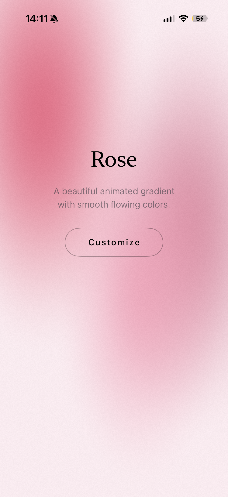
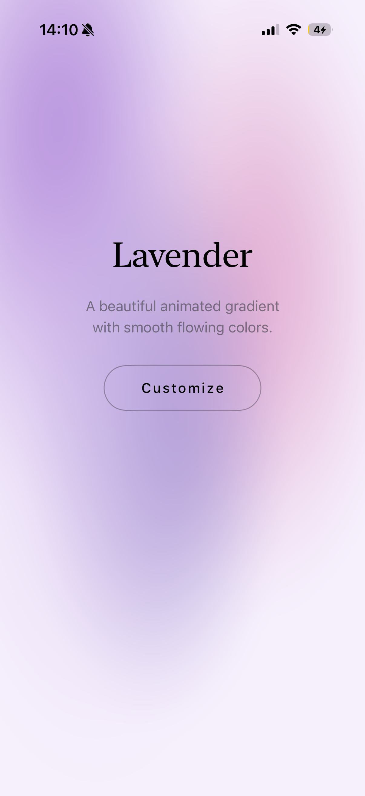
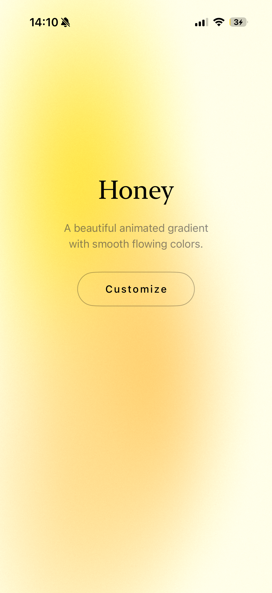
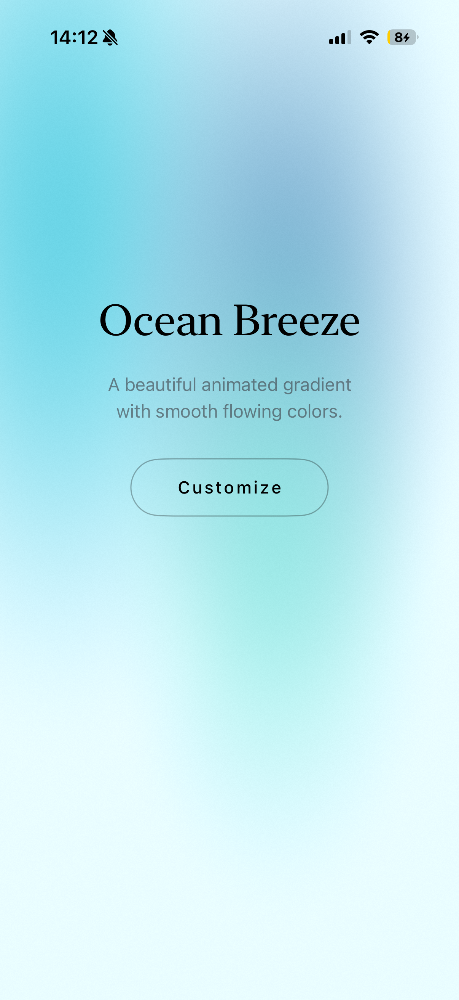
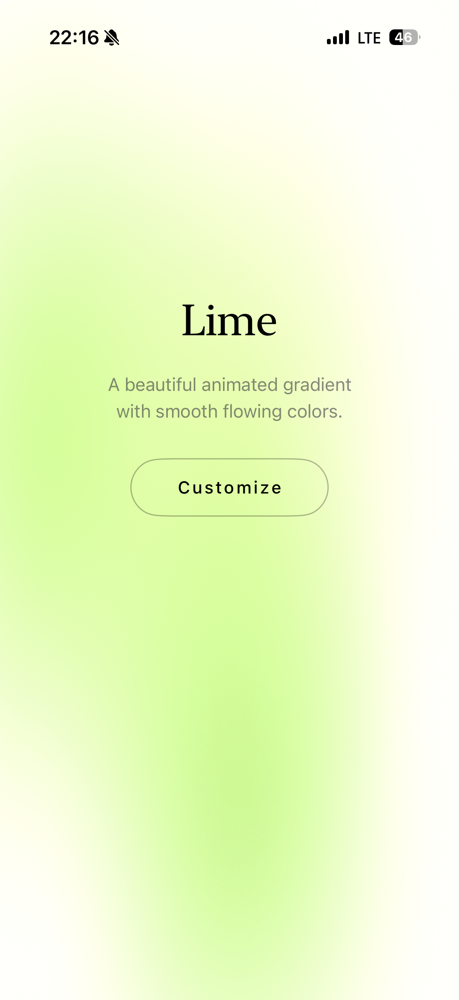

# AnimGrainyGradient

Animated grainy gradient backgrounds with smooth flowing blobs rendered via Metal shaders for backgrounds in SwiftUI Apps.

## Features

- Animated gradient blobs with smooth transitions
- Film grain effect with static option
- 20 customizable presets
- Adjustable animation speed, saturation, brightness, and more
- Hardware-accelerated Metal rendering

## Planned Features

* [ ] **Dynamic Dark Theme** - Auto-detect system appearance and adapt gradient colors
* [ ] **View Transitions** - Smooth crossfade between gradient or view changes
* [ ] **Appear Animations** - Fade-in, scale, blob coming out of screen animations on view appear
* [ ] **Interactive Gestures** - Blobs respond to touch/mouse interactions
* [ ] **Noise Types** - Multiple noise algorithms (Perlin, Simplex, Worley)
* [ ] **Color Temperature** - Warm/cool color temperature adjustment

## Screenshots (don't mind the battery)

<div style="display: flex; flex-wrap: wrap; gap: 8px;">
  
  
  
  
  
  
  
  
</div>

## Quick Usage

```swift
import SwiftUI
import AnimGrainyGradient

struct ContentView: View {
    @StateObject private var settings = GradientSettings()
    
    var body: some View {
        ZStack {
            AnimatedGradientView(
                preset: settings.selectedPreset,
                grainIntensity: settings.grainIntensity,
                animationSpeed: settings.animationSpeed,
                saturation: settings.saturation,
                brightness: settings.brightness,
                blurRadius: settings.blurRadius,
                flowDistortion: settings.flowDistortion,
                liquidEffect: settings.liquidEffect,
                enableStatic: settings.enableStatic,
                transitionSpeed: settings.transitionSpeed
            )
            .ignoresSafeArea()
            
            // Your overlay content here
        }
    }
}
```

Or use a preset directly:

```swift
AnimatedGradientView(preset: .aurora)
```

## Settings

| Setting | Type | Default | Range | Description |
|---------|------|---------|-------|-------------|
| `preset` | `GradientPreset` | `.serendipity` | - | Pre-defined color theme |
| `grainIntensity` | `Float` | `0.08` | `0.0 - 0.5` | Film grain overlay strength |
| `animationSpeed` | `Float` | `1.0` | `0.1 - 5.0` | Blob animation speed |
| `liquidEffect` | `Float` | `0.5` | `0.0 - 2.0` | Liquid distortion amount |
| `saturation` | `Float` | `1.0` | `0.0 - 2.0` | Color saturation level |
| `brightness` | `Float` | `1.0` | `0.5 - 1.5` | Overall brightness |
| `blurRadius` | `Float` | `0.3` | `0.0 - 1.0` | Blob edge softness |
| `flowDistortion` | `Float` | `0.02` | `0.0 - 0.1` | Flow noise distortion |
| `enableStatic` | `Bool` | `false` | - | Toggle film static effect |
| `transitionSpeed` | `Float` | `2.0` | `0.5 - 10.0` | Blob transition speed |
| `selectedTransitionMode` | `BlobTransitionMode` | `.orbit` | - | Animation pattern |

## Presets

| Preset | Description |
|--------|-------------|
| `serendipity` | Soft blue-lavender tones |
| `aurora` | Vibrant green-purple aurora |
| `sunset` | Warm orange-red sunset |
| `ocean` | Deep blue ocean waves |
| `lavender` | Light purple tones |
| `mint` | Fresh mint green |
| `warmGlow` | Warm golden glow |
| `midnight` | Dark purple-blue night |
| `peach` | Soft peach tones |
| `forest` | Deep green forest |
| `rose` | Romantic rose pink |
| `sky` | Light blue sky |
| `coral` | Vibrant coral |
| `lime` | Fresh lime green |
| `berry` | Rich berry purple |
| `honey` | Golden honey tones |
| `oceanBreeze` | Light ocean breeze |
| `purpleHaze` | Purple haze effect |
| `sunrise` | Morning sunrise |
| `denim` | Classic denim blue |

## Transition Modes

| Mode | Description |
|------|-------------|
| `.orbit` | Blobs orbit around their positions |
| `.smoothMove` | Blobs smoothly move to new positions |
| `.splitMerge` | Blobs split and merge together |
| `.breathe` | Blobs expand and contract |
| `.wave` | Blobs move in wave patterns |

## Custom Configuration Example

```swift
let customConfig = GradientConfiguration(
    blobs: [
        GradientBlob(r: 0.2, g: 0.6, b: 1.0, a: 0.9, 
                     position: SIMD2<Float>(0.3, 0.3), 
                     radius: 0.5, speed: 0.3),
        GradientBlob(r: 0.8, g: 0.3, b: 0.6, a: 0.8, 
                     position: SIMD2<Float>(0.7, 0.6), 
                     radius: 0.4, speed: 0.25),
    ],
    backgroundColor: Color(red: 0.05, green: 0.05, blue: 0.15),
    grainIntensity: 0.1,
    animationSpeed: 0.6,
    blurRadius: 0.35,
    saturation: 1.2,
    brightness: 1.0,
    flowDistortion: 0.025,
    liquidEffect: 0.7,
    enableStatic: true,
    transitionSpeed: 1.5
)
```

## Custom Preset

Add your custom preset to the `GradientPreset` enum in `GradientPreset.swift`:

```swift
// In GradientPreset.swift, add to the enum:
case myCustom = "My Custom"
```

Then add its configuration in the `configuration` property:

```swift
case .myCustom:
    return GradientConfiguration(
        blobs: [
            GradientBlob(r: 0.2, g: 0.6, b: 1.0, a: 0.9, 
                         position: SIMD2<Float>(0.3, 0.3), 
                         radius: 0.5, speed: 0.3),
            GradientBlob(r: 0.8, g: 0.3, b: 0.6, a: 0.8, 
                         position: SIMD2<Float>(0.7, 0.6), 
                         radius: 0.4, speed: 0.25),
        ],
        backgroundColor: Color(red: 0.05, green: 0.05, blue: 0.15),
        grainIntensity: 0.1,
        animationSpeed: 0.6,
        blurRadius: 0.35,
        saturation: 1.2,
        brightness: 1.0,
        flowDistortion: 0.025,
        liquidEffect: 0.7,
        enableStatic: true,
        transitionSpeed: 1.5
    )
```

Then use it:

```swift
AnimatedGradientView(preset: .myCustom)
```
